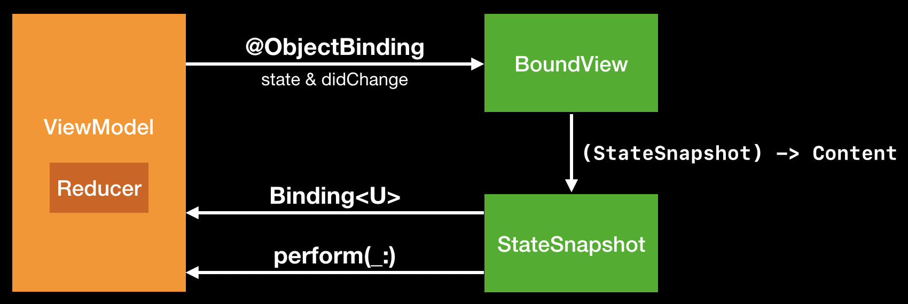

### Notice of archival
Check out [ReactiveCocoa/Loop](https://github.com/ReactiveCocoa/Loop) for a [ReactiveSwift](https://github.com/ReactiveCocoa/ReactiveSwift)-based unidirectional data flow architecture that can integrate with SwiftUI. If you aren't adopting SwiftUI just yet, it can be used in conjunction with declarative UI frameworks like [Bento](https://github.com/babylonpartners/Bento) or [Carbon](https://github.com/ra1028/Carbon) to provide you a SwiftUI-like developer experience.

Check out [Pointfree's Compositional Architecture](https://github.com/pointfreeco/swift-composable-architecture) if you are building a SwiftUI + Combine application from scratch, and you aren't already familiar with the unidirectional data flow pattern.

### Data flow

